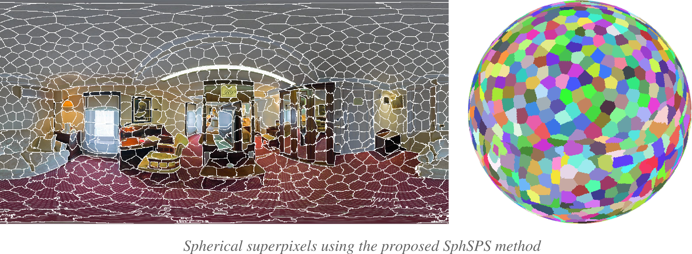

# SphSPS: Spherical Shortest Path-based Superpixels

### Overview

Implementation of paper:   [PDF](https://arxiv.org/abs/2004.07394) 
```
@InProceedings{giraud2020sphsps,
    author   = {Rémi Giraud and Rodrigo Borba Pinheiro and Yannick Berthoumieu},
    title    = {Generalization of the Shortest Path Approach for Superpixel Segmentation of Omnidirectional Images},
    booktitle  = {Pattern Recognition (PR)},
    YEAR   = {2023},
}
```

- Segmentation of 360° spherical images into regular superpixels: 



- Generalized Global Regularity Metric (G-GR) for evaluation of spatial superpixel regularity in the spherical space based on:
```
@InProceedings{giraud2017gr,
    author   = {Rémi Giraud and Vinh-Thong Ta and Nicolas Papadakis},
    title    = {Evaluation Framework of Superpixel Methods with a Global Regularity Measure,
    booktitle  = {Journal of Electronic Imaging},
    YEAR   = {2017},
}
```


### Requirements

- Linux

- For C++ version:  [CImg library](http://cimg.eu/)  (unique .h already included)

- A contour prior map can be provided to our method (for C++: an image with 255 for highest contour intensity)  
The contour detection method used in this work is available [here](https://github.com/sniklaus/pytorch-hed)  
Other contour detection methods can be found [here](https://www2.eecs.berkeley.edu/Research/Projects/CS/vision/grouping/resources.html)


### Execution

#### MATLAB / C-Mex
```
run main.m    %call SphSPS_mex
```


#### C++

- Compilation:
```
make
```

- Execution prototype:
```
./SphSPS -i img_name [-k superpixel_nbr(1000)] [-m compactness(0.12)]  [-outm output_map_name(res/labelmap.png)] [-outb output_border_name(res/borders.png)]  [-c contour(NULL)]
```
- Execution with contour map:  (make test)
``` 
./SphSPS -i ./data/test_img1.jpg -k 1500 -m 0.12 -outm test_img1_map.png -outb test_img1_border.png -c ./data/test_img1_contour.png
```
- Execution on an image list:  (make test_list)
```
./scripts/test_list.sh ./data/list_file.txt ./data/ 1000 0.12
```

### Data

The dataset of 75 manually annotated spherical images of size 512x1024 pixels capturing panoramas is available 
[here](https://github.com/tdsuper/SphericalSuperpixels)  
These images are extracted from the [SUN360 dataset](https://vision.princeton.edu/projects/2012/SUN360/data/) 


### License

(C) Rémi Giraud, 2020  
remi.giraud@u-bordeaux.fr  
[https://remi-giraud.enseirb-matmeca.fr](https://remi-giraud.enseirb-matmeca.fr)   
ENSEIRB-MATMECA (Bordeaux INP), Laboratory IMS

This code is free to use, share and modify for any non-commercial purposes.
Any commercial use is strictly prohibited without the authors' consent, also including authors from (chen2017) since SphSPS uses some part of their code:
```
@InProceedings{chen2017,
    author   = {Jiansheng Chen and Zhengqin Li and Bo Huang},
    title    = {Linear Spectral Clustering Superpixel},
    booktitle  = {IEEE Transactions on Image Processing},
    YEAR   = {2017},
}
```
